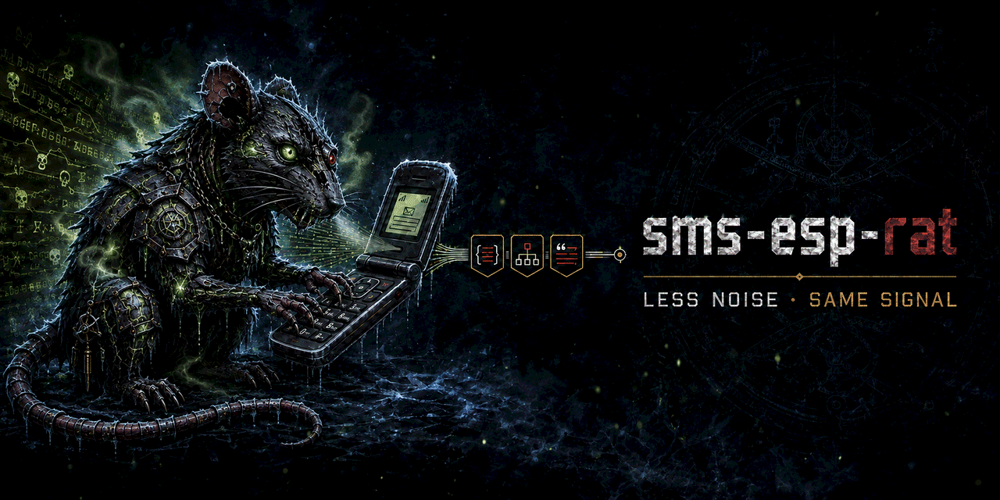

# sms-esp-rat



[](https://github.com/0xCyberBerserker/sms-esp-rat/stargazers)
[](LICENSE)
[](https://github.com/0xCyberBerserker/sms-esp-rat/commits/main)


Codex post-processing skill for token-efficient Spanish technical answers. It runs conceptually after `token-rat-esp`, combining measured telegraphic phrasing with semantic compression, integrity guards, and a reproducible benchmark while preserving technical literals.

`raw -> token-rat-esp -> sms-esp-rat -> final`

## Recommended installation

Install both skills, in this order: `token-rat-esp` first and `sms-esp-rat` second. The destination directories below must not already exist.

```bash
CODEX_SKILLS="${CODEX_HOME:-$HOME/.codex}/skills"
mkdir -p "$CODEX_SKILLS"
test ! -e "$CODEX_SKILLS/token-rat-esp"
test ! -e "$CODEX_SKILLS/sms-esp-rat"
git clone https://github.com/0xCyberBerserker/token-rat-esp.git "$CODEX_SKILLS/token-rat-esp"
git clone https://github.com/0xCyberBerserker/sms-esp-rat.git "$CODEX_SKILLS/sms-esp-rat"
test -f "$CODEX_SKILLS/token-rat-esp/SKILL.md"
test -f "$CODEX_SKILLS/sms-esp-rat/SKILL.md"
```

The skills become discoverable on the next Codex turn. To request the complete pipeline explicitly, use: `Use $token-rat-esp first and then $sms-esp-rat.`

## Relationship with token-rat-esp

`sms-esp-rat` builds on the scope control and concise technical Spanish provided by `token-rat-esp`; it does not replace it. The base skill removes unnecessary content and keeps patches and explanations focused. This skill then compresses the remaining representation through guarded telegraphic phrasing and a measured semantic codebook. For that reason, the benchmark uses `token-rat-esp` alone as variant B and measures the incremental contribution of `sms-esp-rat` against it.

## Mathematical model

For reference variant (r) and candidate (v), output-token saving and reduction are:

$$
\Delta O_{r\rightarrow v}=O_r-O_v
$$

$$
R_{r\rightarrow v}=100\times\frac{O_r-O_v}{O_r}
$$

The primary comparison is B (`token-rat-esp`) against E (full pipeline):

$$
R_{B\rightarrow E}=100\times\frac{7714-6872}{7714}=10.9\%
$$

Technical integrity is a hard gate: (H=0\Rightarrow\mathrm{FAIL}), regardless of token savings. For a macro with expansion cost (e), alias cost (a), and frequency (f), estimated gain is (G=f(e-a)). If mean input overhead is (h) and mean output saving is (s), session break-even is (N^{*}=h/s). For E, (N^{*}=770.47/8.42\approx91.5), about 92 responses.

See [docs/modelo-matematico.md](docs/modelo-matematico.md) for symbols, derivations, fidelity, integrity, exact-echo framing, ablation, caching, and worked examples.

## Quick start

```bash
python scripts/build_corpus.py
python -m unittest discover -s tests -v
python scripts/bench_sms_esp_rat.py --phase probe --max-calls 30
python scripts/bench_sms_esp_rat.py --phase smoke --max-calls 30
```

Benchmark phases are `probe`, `smoke`, `dev`, and `final`. Results are cached by case, prompt, variant, model, reasoning level, and harness version. The default model is `gpt-6-astra` with `low` reasoning.

See [manual_usuario.md](manual_usuario.md) for use, [results/benchmark-report.md](results/benchmark-report.md) for measured results, and [docs/github-publication.md](docs/github-publication.md) for prepared GitHub metadata.

## Acknowledgements

The author of this project created the `lorem` mode and its reserved macro after an initial suggestion from [Miguel Ángel Díaz Oliva](https://dedmaphoto.vercel.app/).

## License

[MIT](LICENSE).

---

# sms-esp-rat (Español)

Skill de posprocesado para Codex orientada a respuestas técnicas en español con uso eficiente de tokens. Se aplica conceptualmente después de `token-rat-esp` y combina redacción telegráfica medida, compresión semántica, controles de integridad y un benchmark reproducible, preservando los literales técnicos.

## Instalación recomendada

Instala las dos skills y respeta este orden: primero `token-rat-esp` y después `sms-esp-rat`. Los directorios de destino indicados no deben existir previamente.

```bash
CODEX_SKILLS="${CODEX_HOME:-$HOME/.codex}/skills"
mkdir -p "$CODEX_SKILLS"
test ! -e "$CODEX_SKILLS/token-rat-esp"
test ! -e "$CODEX_SKILLS/sms-esp-rat"
git clone https://github.com/0xCyberBerserker/token-rat-esp.git "$CODEX_SKILLS/token-rat-esp"
git clone https://github.com/0xCyberBerserker/sms-esp-rat.git "$CODEX_SKILLS/sms-esp-rat"
test -f "$CODEX_SKILLS/token-rat-esp/SKILL.md"
test -f "$CODEX_SKILLS/sms-esp-rat/SKILL.md"
```

Las skills estarán disponibles en el siguiente turno de Codex. Para solicitar explícitamente el pipeline completo, escribe: `Usa primero $token-rat-esp y después $sms-esp-rat.`

## Relación con token-rat-esp

`sms-esp-rat` parte del control de alcance y del español técnico conciso aportados por `token-rat-esp`; no lo sustituye. La skill base elimina contenido innecesario y mantiene enfocados los patches y las explicaciones. Después, esta skill comprime la representación restante mediante redacción telegráfica protegida y un codebook semántico medido. Por ello, el benchmark utiliza `token-rat-esp` por separado como variante B y mide frente a ella la aportación incremental de `sms-esp-rat`.

## Modelo matemático

Para una variante de referencia (r) y una candidata (v), el ahorro y la reducción de output tokens son:

$$
\Delta O_{r\rightarrow v}=O_r-O_v
$$

$$
R_{r\rightarrow v}=100\times\frac{O_r-O_v}{O_r}
$$

La comparación principal enfrenta B (`token-rat-esp`) con E (pipeline completo):

$$
R_{B\rightarrow E}=100\times\frac{7714-6872}{7714}=10.9\%
$$

La integridad técnica es una puerta dura: (H=0\Rightarrow\mathrm{FAIL}), aunque exista ahorro. Para una macro con coste de expansión (e), coste de alias (a) y frecuencia (f), la ganancia estimada es (G=f(e-a)). Si el overhead medio de entrada es (h) y el ahorro medio de salida es (s), el break-even de sesión es (N^{*}=h/s). Para E, (N^{*}=770.47/8.42\approx91.5): unas 92 respuestas.

Consulta [docs/modelo-matematico.md](docs/modelo-matematico.md) para ver símbolos, derivaciones, fidelidad, integridad, framing del eco exacto, ablación, caché y ejemplos resueltos.

## Inicio rápido

```bash
python scripts/build_corpus.py
python -m unittest discover -s tests -v
python scripts/bench_sms_esp_rat.py --phase probe --max-calls 30
python scripts/bench_sms_esp_rat.py --phase smoke --max-calls 30
```

Las fases son `probe`, `smoke`, `dev` y `final`. La caché se invalida por caso, prompt, variante, modelo, reasoning y versión del harness. El modelo predeterminado es `gpt-6-astra` con reasoning `low`.

Consulta [docs/github-publication.md](docs/github-publication.md) para ver la descripción, las etiquetas y el checklist de publicación preparados para GitHub.

## Créditos

El autor de este proyecto creó el modo `lorem` y su macro reservada a partir de una sugerencia inicial de [Miguel Ángel Díaz Oliva](https://dedmaphoto.vercel.app/).

## Licencia

[MIT](LICENSE).

Made with 🖤 in Barcelona City 🇪🇸
